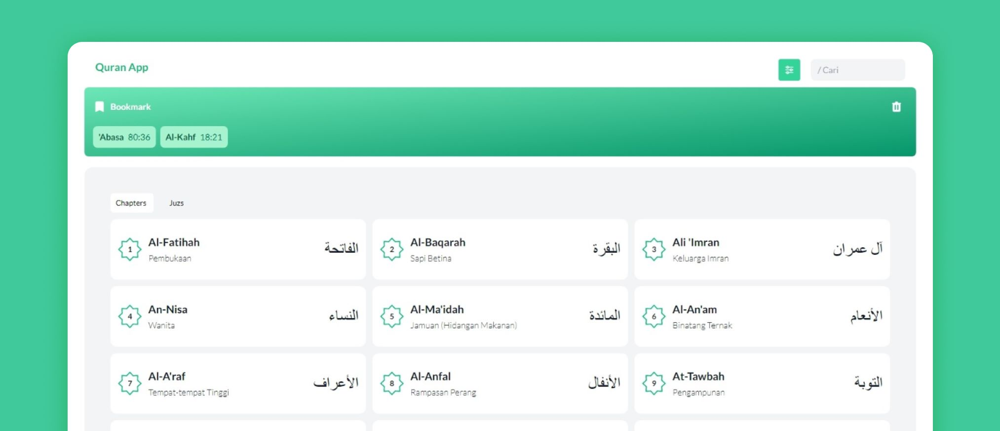

<!-- PROJECT LOGO -->
<br />
<p align="center">
  <a href="https://quranapp.acmal.me">
    
  </a>

  <p align="center">
    <a href="https://quranapp.acmal.me">Visit QuranApp</a>
  </p>
</p>


<h2 id="about">About QuranApp</h2>
WEB-based reading application, the purpose of this application is so that Muslim people can read and listen to Murottal anywhere and anytime without having to download the application as long as the device remains connected to the internet.

<br/>

<h2 id="features">Features</h2>
- Dark Theme
<br/>
- Auto Highlight Verse When Playing Audio
<br/>
- Mark Verse
<br/>
- PWA (Progressive Web Apps)

<br/>

<h2 id="credits">Credits</h2>
- API Data Source <a href="https://quran.api-docs.io/v4/getting-started/introduction">Quran.com</a>

<br/>


This is a [Next.js](https://nextjs.org/) project bootstrapped with [`create-next-app`](https://github.com/vercel/next.js/tree/canary/packages/create-next-app) and using [`tailwind`](https://tailwindcss.com/) for styling

<br/>
<hr/>
<br/>


## Getting Started

First, run the development server:

```bash
npm run dev
# or
yarn dev
```

Open [http://localhost:3000](http://localhost:3000) with your browser to see the result.

You can start editing the page by modifying `pages/index.js`. The page auto-updates as you edit the file.

[API routes](https://nextjs.org/docs/api-routes/introduction) can be accessed on [http://localhost:3000/api/hello](http://localhost:3000/api/hello). This endpoint can be edited in `pages/api/hello.js`.

The `pages/api` directory is mapped to `/api/*`. Files in this directory are treated as [API routes](https://nextjs.org/docs/api-routes/introduction) instead of React pages.

## Learn More

To learn more about Next.js, take a look at the following resources:

- [Next.js Documentation](https://nextjs.org/docs) - learn about Next.js features and API.
- [Learn Next.js](https://nextjs.org/learn) - an interactive Next.js tutorial.

You can check out [the Next.js GitHub repository](https://github.com/vercel/next.js/) - your feedback and contributions are welcome!

## Deploy on Vercel

The easiest way to deploy your Next.js app is to use the [Vercel Platform](https://vercel.com/new?utm_medium=default-template&filter=next.js&utm_source=create-next-app&utm_campaign=create-next-app-readme) from the creators of Next.js.

Check out our [Next.js deployment documentation](https://nextjs.org/docs/deployment) for more details.
